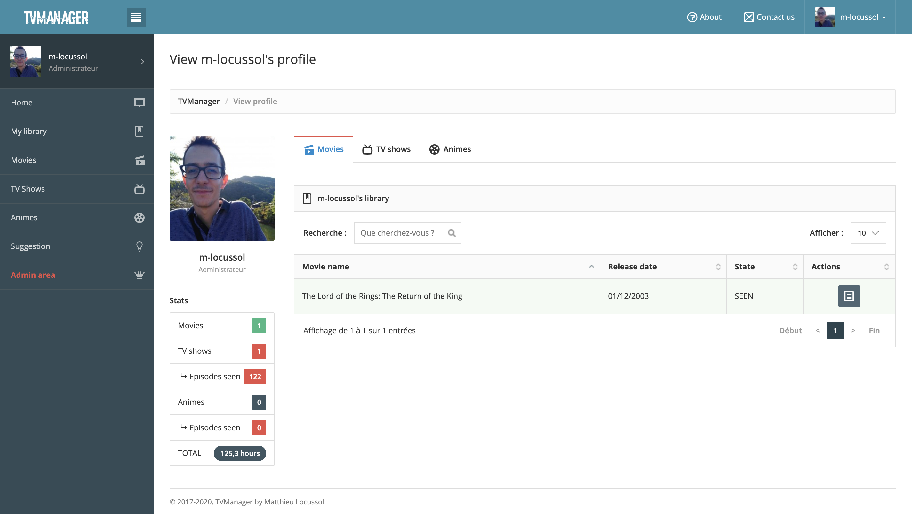
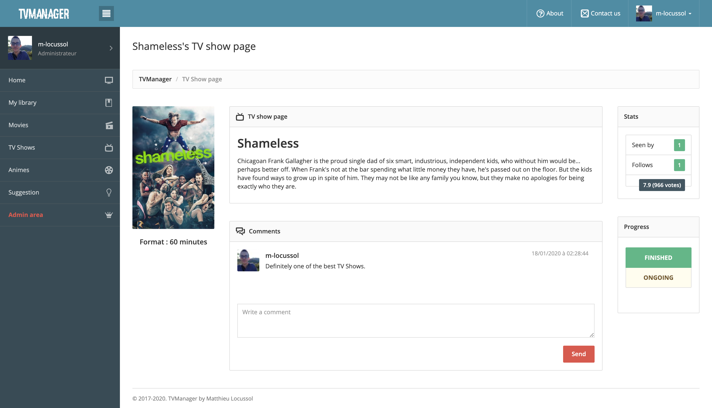
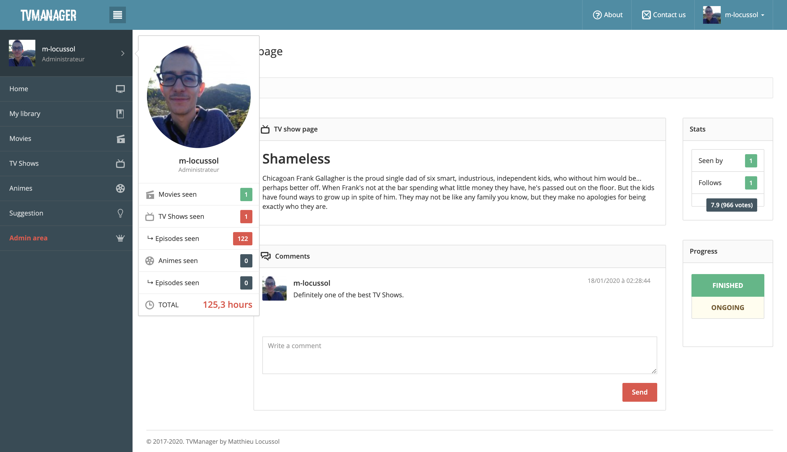
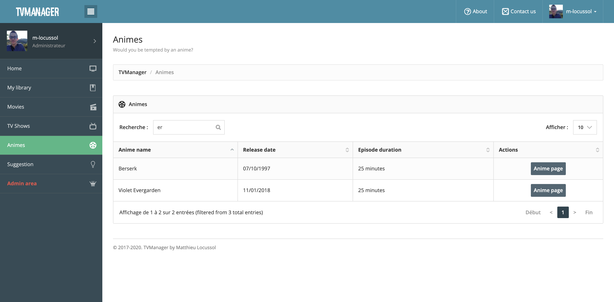
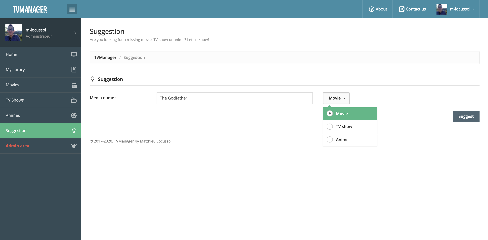
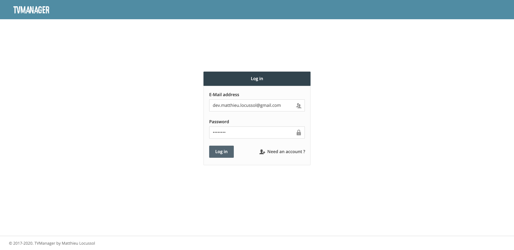

TVManager allows you to better manage your media library : TV Shows, Movies and Animes. It makes use of the [TMDB API](https://developers.themoviedb.org/3) to retrieve all data and keep the website up to date.

*Project carried out as part of my second year at [INP-ENSEEIHT](http://www.enseeiht.fr/en/home.html).*

## Features

* Member area & Admin area
* Movies, TV Shows and Animes retrieval using TMDB API
* Browse Movies, TV Shows and Animes
* Comments sections
* User profile page
* User library management
* Watchlist tracking
* Gravatar API for profile pictures
* Suggestion page
* Contact page
* About page
* Can add as many ranks as needed

## Screenshots and preview

*Currently no preview is available as I don't have any web server to host the JBoss project. Though, it is quite straightforward to host the project locally if you want to give it a try.*

## Dependencies

* [JBoss EAP 7.0.0+](https://developers.redhat.com/products/eap/download)